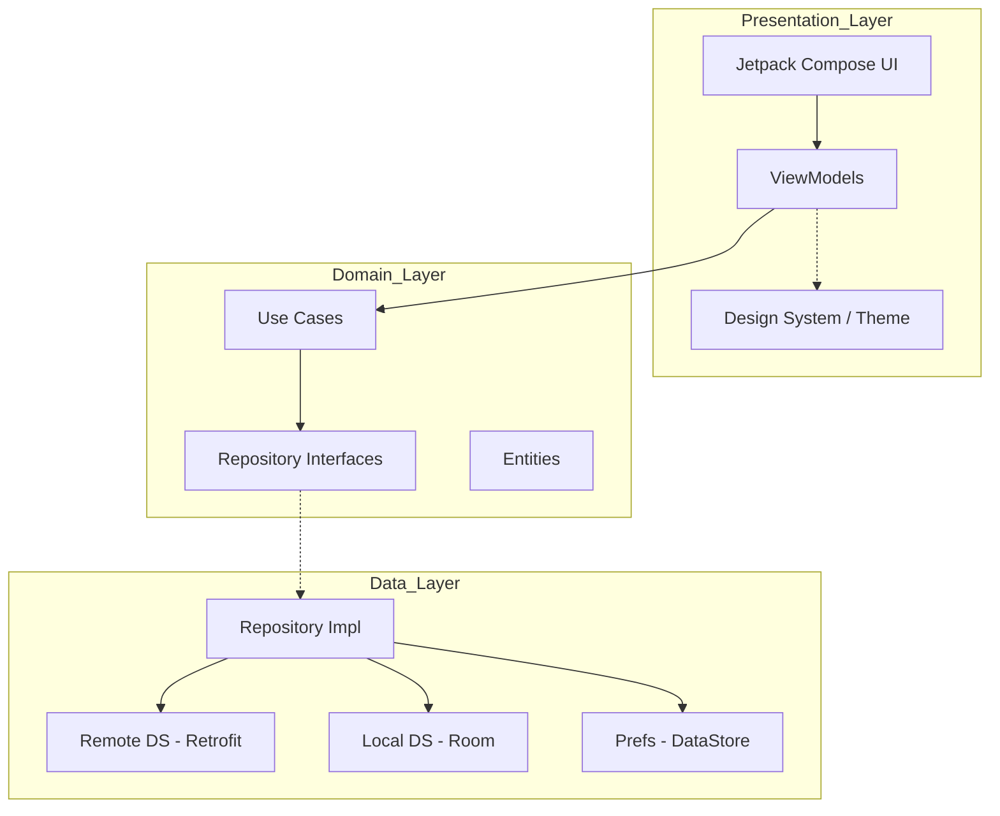
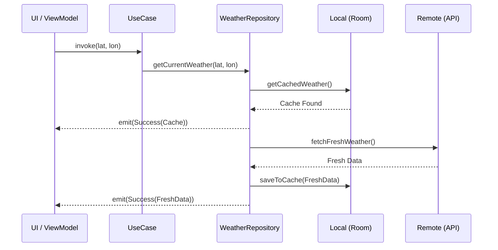

# Weather App 🌦️

[](https://kotlinlang.org)
[](https://developer.android.com/jetpack/compose)
[]()
[](LICENSE)

A professional-grade, high-performance Android Weather Application built with **Jetpack Compose**, following **Clean Architecture** principles. The app provides real-time weather intelligence, localized alerts, and a robust offline-first experience tailored for both English and Arabic users.

---


---

## 📸 Screenshots

<div align="center">
  <table style="width:100%">
    <tr>
      <td style="width:25%"></td>
      <td style="width:25%"></td>
      <td style="width:25%"></td>
      <td style="width:25%"></td>
    </tr>
    <tr>
      <td align="center"><b>Dynamic Home</b></td>
      <td align="center"><b>Weather Alerts</b></td>
      <td align="center"><b>Custom Settings</b></td>
      <td align="center"><b>Map Selection</b></td>
    </tr>
  </table>
</div>

---

## 🚀 Key Features

### 📡 Real-time Intelligence
- **Live Weather Updates**: Precise meteorological data via OpenWeatherMap API.
- **Weather Alerts**: A dedicated notification hub designed to monitor atmospheric changes, severe weather warnings, and temperature thresholds to keep users safe and informed.

### 📍 Smart Location Services
- **GPS-Aware**: Automatic location detection with intelligent fallbacks to last known positions.
- **Manual Map Picker**: Interactive location selection using **MapLibre SDK** with reverse geocoding.

### 🌍 Global Localization
- **Dual Language Support**: Full **English (LTR)** and **Arabic (RTL)** optimization.
- **Dynamic Typography**: Automatic font switching between **Urbanist** (Latin) and **Cairo** (Arabic) for optimal readability.

### 🛠️ User Personalization
- **Intelligent Theming**: Adaptive Light/Dark modes using a custom Material 3 color system.
- **Unit Customization**: Support for multiple temperature (C/F/K) and wind speed (m/s, mph) metrics.

---

## 🏗️ Technical Architecture

The project adheres to **Clean Architecture** to ensure a separation of concerns, making the codebase highly testable, maintainable, and scalable.

### System Design


---

## 🔄 Core Workflows

### Offline-First Data Strategy
The application prioritizes user experience by delivering immediate data from the local cache while synchronizing with the cloud in the background.



---

## 🛠️ Tech Stack

| Category | Technology |
|---|---|
| **UI Framework** | Jetpack Compose (Material 3) |
| **Dependency Injection** | Koin 4.0 |
| **Networking** | Retrofit 2.11 + OkHttp |
| **Persistence** | Room DB + Jetpack DataStore |
| **Concurrency** | Kotlin Coroutines & Flow |
| **Maps** | MapLibre SDK |
| **Image Loading** | Coil 2.7 |

---

## 🚦 Getting Started & Testing

> [!IMPORTANT]  
> **API Key Requirement**: To run or test this project, you **MUST** provide an OpenWeatherMap API key. The application will not function without this configuration.

### Setup Instructions
1.  **Clone the Repository**:
    ```bash
    git clone https://github.com/yourusername/weatherapp2.git
    ```
2.  **Configure API Key**:
    Open (or create) `local.properties` in your project root and add your key:
    ```properties
    WEATHER_API_KEY=your_openweathermap_api_key_here
    ```
3.  **Build & Run**: Open the project in **Android Studio Ladybug** (or newer) and sync Gradle.

---

## 🧪 Testing Strategy
- **Unit Tests**: Domain Use Cases and mapping logic validation.
- **Integration Tests**: Verification of Offline-First flows and DataStore/Room persistence.
- **UI Tests**: Automated testing for various `UiState` scenarios (Loading, Success, Error).

---

## 📜 Engineering Standards
- **Modular Design**: Clean separation of layers (Domain, Data, Presentation).
- **RTL Compliance**: 100% automated layout direction and resource handling.
- **State Management**: Unidirectional Data Flow (UDF) using `StateFlow` and `SharedFlow`.

---

## 📄 License
This project is licensed under the MIT License.

## 🤝 Contact
Project Link: [https://github.com/yourusername/weatherapp2](https://github.com/yourusername/weatherapp2)
